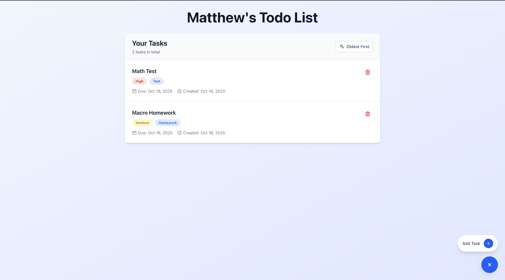

# 📝 Mental Health Todo List Application

A full-stack To-Do list application built with React, TypeScript, Node.js, Express, and MongoDB.
I designed this project to create a simple, calming To-Do experience that reduces overwhelm rather than adds to it. With so many responsibilities in daily life, traditional task lists can sometimes feel daunting. My goal was to design a To-Do app that brings clarity and perspective—helping users feel that their tasks are manageable, so they can spend more time taking action and less time feeling stressed!

## Current website example



## 🚀 Live Demo

**Frontend**: http://localhost:5174  
**Backend API**: http://localhost:4000

## ✨ Features

### 🎨 **Modern UI/UX**
- **Responsive Design**: Works seamlessly on desktop and mobile devices
- **Expandable FAB**: Floating action button with smooth animations
- **Modal Forms**: Clean task creation with backdrop transparency
- **Sort Functionality**: Toggle between newest and oldest tasks
- **Visual Feedback**: Loading states, hover effects, and smooth transitions

### 🔧 **Technical Features**
- **Full-Stack TypeScript**: End-to-end type safety
- **RESTful API**: Clean, well-structured backend endpoints
- **Real-time Updates**: Instant UI updates after operations
- **Error Handling**: Comprehensive error management with user feedback
- **CORS Configuration**: Secure cross-origin communication

### 📋 **Task Management**
- **Create Tasks**: Add new todos with importance levels, categories, and due dates
- **View Tasks**: Display all tasks with creation dates and metadata
- **Delete Tasks**: Remove completed or unwanted tasks
- **Sort Tasks**: Organize by newest or oldest creation date
- **Task Details**: Importance levels, categories, and due dates

## 🛠️ Tech Stack

### **Frontend**
- **React 18** - Modern UI library with hooks
- **TypeScript** - Type-safe development
- **Tailwind CSS** - Utility-first styling
- **Vite** - Fast build tool and dev server
- **Axios** - HTTP client for API communication

### **Backend**
- **Node.js** - JavaScript runtime
- **Express.js** - Web framework
- **TypeScript** - Type-safe backend development
- **MongoDB** - NoSQL database
- **Mongoose** - MongoDB object modeling
- **CORS** - Cross-origin resource sharing

### **Development Tools**
- **ES Modules** - Modern JavaScript module system
- **TSX** - TypeScript execution for Node.js
- **Nodemon** - Auto-restart development server
- **Jest** - Testing framework
- **ESLint** - Code linting and formatting

## Architecture

```
├── client/                 # React frontend
│   ├── src/
│   │   ├── components/     # Reusable UI components
│   │   ├── services/       # API communication layer
│   │   ├── types/          # TypeScript type definitions
│   │   └── App.tsx         # Main application component
│   └── package.json
├── backend/                # Node.js backend
│   ├── src/
│   │   ├── controller/     # Request handlers
│   │   ├── models/         # Database models
│   │   ├── routes/         # API route definitions
│   │   ├── services/       # Business logic
│   │   ├── middleware/     # Custom middleware
│   │   └── config/         # Configuration files
│   └── package.json
└── README.md
```

## 🚀 Getting Started

### Prerequisites
- Node.js 20.9.0 or higher
- MongoDB (local or cloud instance)
- npm or yarn package manager

### Installation

1. **Clone the repository**
   ```bash
   git clone <repository-url>
   cd ToDoApp
   ```

2. **Install backend dependencies**
   ```bash
   cd backend
   npm install
   ```

3. **Install frontend dependencies**
   ```bash
   cd ../client
   npm install
   ```

4. **Set up environment variables**
   ```bash
   # Backend .env file
   PORT=4000
   MONGO_URI=your_mongodb_connection_string
   CORS_ORIGIN=http://localhost:5174
   NODE_ENV=development
   ```

### Running the Application

1. **Start the backend server**
   ```bash
   cd backend
   npm run dev
   ```
   Server will start on http://localhost:4000

2. **Start the frontend development server**
   ```bash
   cd client
   npm run dev
   ```
   Frontend will start on http://localhost:5174

## 📚 API Endpoints

| Method | Endpoint | Description |
|--------|----------|-------------|
| GET | `/api/todos` | Get all todos |
| POST | `/api/todos` | Create a new todo |
| GET | `/api/todos/:id` | Get a specific todo |
| PATCH | `/api/todos/:id` | Update a todo |
| DELETE | `/api/todos/:id` | Delete a todo |

## 🧪 Testing

Run the test suite:
```bash
cd backend
npm test
```

## 📦 Build for Production

**Frontend:**
```bash
cd client
npm run build
```

**Backend:**
```bash
cd backend
npm run build
```

## Current key features

### **Modern Development Practices**
- ✅ **ES Modules**: Using latest JavaScript module system
- ✅ **TypeScript**: Full type safety across frontend and backend
- ✅ **Component Architecture**: Reusable, maintainable React components
- ✅ **API Design**: RESTful endpoints with proper error handling

### **User Experience Focus**
- ✅ **Smooth Animations**: CSS transitions and transforms
- ✅ **Responsive Design**: Works on all device sizes
- ✅ **Intuitive UI**: Modern floating action button pattern
- ✅ **Visual Feedback**: Loading states and hover effects

### **Code Quality**
- ✅ **Clean Architecture**: Separation of concerns
- ✅ **Error Handling**: Comprehensive error management
- ✅ **Scalable Structure**: Easy to extend and maintain

## Future Features
- [ ] Add some other basic features, like adding specific times, showing tasks based off of a time period, etc (mostly sorting tasks).
- [ ] Graphs to show how busy your week/month is
- [ ] A break section to just chill from your To-Do list and the stressful world out there.
- [ ] Stress tracker where user can log current stress and how much stress a certain task causes them
- [ ] Maybe a machine learning model that learns which tasks are the most stressful and how much time you should spend on them, automatically adding them to your daily tasks! Also maybe tracks how well you do on tasks to get a sense of what you are doing. (this will take some time)


*Built with ❤️, you can do it!*
